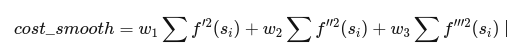

# 自动驾驶规划控制算法技术栈
以应届生角度总结下目前个人认为想要从事自动驾驶规划控制方向需要掌握的技术栈

## 1.系统建模
### 动态系统建模(通过牛顿力学、理论力学等进行系统建模)
### 非线性系统线性化方法
- 泰勒展开
### 连续系统离散化方法
- 向前欧拉法
- 向后欧拉法
- 中点欧拉法

## 2.汽车理论
- 二自由度运动学模型
- 二自由度动力学模型
- 三自由度动力学模型
- 轮胎模型
- 车辆稳定性评价指标
- 车辆底盘原理、通信的基础认识

## 3.坐标系和坐标转换
- 笛卡尔坐标系
- Frenet坐标系
- 坐标转换

## 4.滤波算法、参数辨识

## 5.控制算法
### 5.1基于几何的方法
- 纯追踪
- Stanley

### 5.2基于误差的方法
- PID

### 5.3基于模型的方法
- lqr
- mpc
- 滑模

## 6.优化问题
- 常见二次规划求解器及解算原理

## 7.全局路径规划算法

## 8.局部路径规划算法
### EM
目前为止，主流算法仍然是由Apollo团队设计的EMplanner路径规划算法。该算法基于最优化思想，由动态规划开辟凸空间，由二次规划优化精细路径。同时，该算法也采用了将三维空间解耦成两维空间求解，具体来说就是首先求解路径规划，在路径规划的基础上进行速度规划。最优化中较为重要的是确定矩阵规模，下边将会对矩阵的具体形式进行详细描述帮助大家理解。
#### 路径规划-动态规划
动态规划是指在路径上撒点，如下图所示，7行6列，纵向距离上每隔10m进行取点，横向距离左侧每隔3米取点，右侧每隔3米进行取点，横向上共7个点，我们需要利用动态规划的思想计算所有层之间```代价最小```问题。下图第一列的一个点可以理解为车辆的规划起点。

```
  *  *  *  *  *  *
  *  *  *  *  *  *
  *  *  *  *  *  *
*-*--*--*--*--*--*------reference_line
  *  *  *  *  *  *
  *  *  *  *  *  *
  *  *  *  *  *  *

```

代价计算主要包含：路径平滑代价，参考线距离代价，与障碍物的距离代价，下边将依次介绍这三个代价。  
1. 平滑代价主要考虑l的一阶导，二阶导和三阶导，具体形式如下所示。
 

2. 与障碍物的距离代价主要考虑与障碍物的最小横向、纵向距离，表达形式多种多样，只要满足距离障碍物越近代价越低即可，我这里举一个例子。

3. 参考线代价，这个比较好理解，表示生成的路径尽量要贴近参考线。

总的代价计算公式如下：

动态规划完成之后需要生成凸空间，这也是动态规划的目的，二次规划的前提。凸空间的计算和障碍物息息相关，举个例子，如下图所示，判断路径的l值大于障碍物的l值，则生成的路径在在障碍物的左侧，决策为向左侧进行绕行，l_min=max(l_min, obs_l + obs_width/2)，可得到左侧绕行时二次规划的最小l值。  
同理，如果决策为右侧绕行，l_max = min(l_max, obs_l - oba_width/2)，可得到右侧绕行时二次规划的最大l值。 

```
  *  *  *  *  *  *
  *  *  *  *  *  *
  *  -   *  *  *  *
*----*--*--*--*--*------reference_line
  *  *  *  *  *  *
  *  *  *  *  *  *
  *  *  *  *  *  *
```

#### 路径规划-二次规划

在上一步已经开辟凸空间的前提下，可以进行二次规划。二次规划同样属于最优化问题，考虑平滑代价，参考线代价，在凸空间中央代价，下边将依次介绍这三个代价。  
1. 平滑代价  
平滑代价的计算和动态规划一致，即各阶倒数平方和最小。
2. 参考线代价  
这个也与动态规划的代价一致。
3. 凸空间中央代价  
主要考虑生成的参考线尽量靠近道路中央，具体表达形式如下。  

总的代价计算公式如下：  

除了代价计算仍需考虑约束问题，这里主要考虑的约束问题包含``障碍物约束``，``连续性约束``，``各轨迹点约束``，``起点约束``。下边将详细阐述各个约束的矩阵形式。  
1. 障碍物约束  

