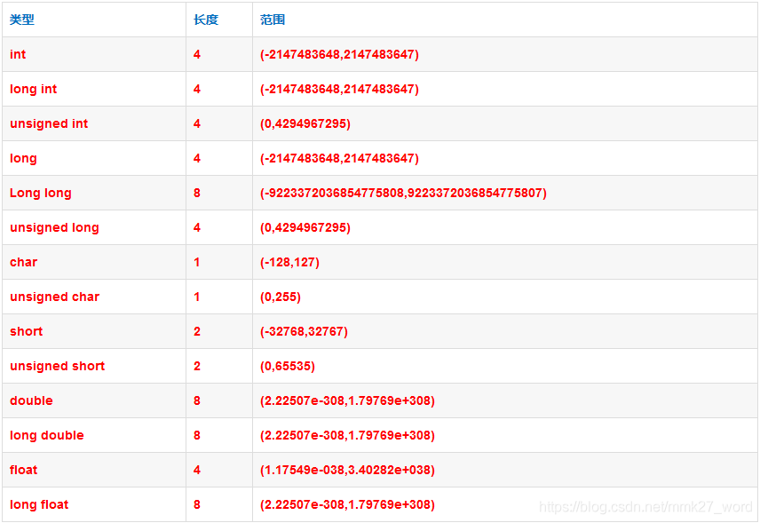

## 1. for循环和while循环各自的优缺点是什么?

for循环初始化和修改都写在语句之前，书写较为简洁，适用于循环次数已知的情况；while初始化在循环体之前，变量修改在循环体中，比较适用于循环次数未知的情况。

## 2. C++标准规定了各个算术类型的最小值，如下表：
| 类型 | 含义| 最小尺寸 |
| --- | --- | --- |
| bool| 布尔类型|未定义|
| char|字符|8位|
|wchar_t|宽字符|16位|
|char16_t|Unicode字符|16位|
|char32_t|Unicode字符|32位|
|short|短整型|16位|
|int|整型|16位|
|long|长整型|32位|
|long long|长整型|64位|
|float|单精度浮点数|6位有效数字|
|double|双精度浮点数|10位有效数字|
|long double|扩展精度浮点数|10位有效数字|

某种操作系统下支持的算术类型占用内存如下图所示：


## 3.类型转换有哪些方式？各自有什么特点？
旧式风格的显式转化：
```cpp
type(expr); //函数形式的强制类型转换
(type)expr; //C语言风格的强制类型转换
```
现代C++风格的类型转换：
```cpp
cast-type<type>(expr);
```
其中type是待转换的目标类型，expr是被转换的值。
cast-type包括static_cast、dynamic_cast、const_cast和reinterpret_cast四种，表示转换的方式。<br>
**static_cast<br>**
```cpp
static_cast<tpye>(expression);
```
任何编写程序时能够明确的类型转换都可以使用static_cast(static_cast不能转换底层const、volatile和__unaligned属性)，由于不提供运行时的检查，所以叫static_cast，因此在编写程序时要确认转换的安全性。<br>
主要在以下几种场合中使用：

1.用于类层次结构中，父类和子类之间指针和引用的转换；进行上行转换，将子类对象的指针/引用转换成父类指针/引用，这种转换是安全的；进行下行转换，把父类对象的指针/引用转换成子类指针/引用，这种转换是不安全的，需要编写程序时确认；

2.用于基本数据类型之间的转换，例如把int转换为char，int转换为enum等，需要编写程序时确认安全性

3.把void指针转换成目标类型的指针（极其不安全）
```cpp
int i, j;
double slope = static_cast<double>(j)/i;
void *p = &d;
double *p = static_cast<double*>(p);
```
**dynamic_cast**
格式：
```cpp
dynamic_cast<type>(expression);
```
相比static_cast，dynamic_cast会在运行时检查类型转换是否合法，具有一定的安全性。由于运行时的检查，所以会额外消耗一些性能。使用场景和static_cast类似，在类层次结构中使用，上行转换和其一致，下行转换会检查转换类型，相比static_cast安全。<br>
dynamic_cast转换仅适用于指针或引用，在转换可能发生的前提下，dynamic_cast会尝试转换，若指针转换失败，则返回空指针，若引用转换失败，则抛出异常。
**const_cast**
const_cast用于移除类型的const volatile __unaligned属性，常量指针被转换位非常量指针，并且仍然指向原来的对象；常量引用被转换为非常量引用，并且仍然引用原来的对象。
```cpp
const char *pc;
char *p = const_cast<char*>(pc);
```
**reinterpret_cast**
格式：
```cpp
reinterpret_cast<type>(expression)
```
非常激进的指针类型转换，在编译期完成，可以转换任何类型的指针，所以极不安全。非极端情况不要使用。