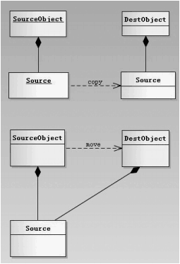

## 1. for循环和while循环各自的优缺点是什么?
for循环初始化和修改都写在语句之前，书写较为简洁，适用于循环次数已知的情况；while初始化在循环体之前，变量修改在循环体中，比较适用于循环次数未知的情况。

## 2. C++标准规定了各个算术类型的最小值，如下表：
| 类型 | 含义| 最小尺寸 |
| --- | --- | --- |
| bool| 布尔类型|未定义|
| char|字符|8位|
|wchar_t|宽字符|16位|
|char16_t|Unicode字符|16位|
|char32_t|Unicode字符|32位|
|short|短整型|16位|
|int|整型|16位|
|long|长整型|32位|
|long long|长整型|64位|
|float|单精度浮点数|6位有效数字|
|double|双精度浮点数|10位有效数字|
|long double|扩展精度浮点数|10位有效数字|

某种操作系统下支持的算术类型占用内存如下图所示：


## 3.类型转换有哪些方式？各自有什么特点？
旧式风格的显式转化：
```cpp
type(expr); //函数形式的强制类型转换
(type)expr; //C语言风格的强制类型转换
```
现代C++风格的类型转换：
```cpp
cast-type<type>(expr);
```
其中type是待转换的目标类型，expr是被转换的值。
cast-type包括static_cast、dynamic_cast、const_cast和reinterpret_cast四种，表示转换的方式。<br>
- **static_cast<br>**
```cpp
static_cast<tpye>(expression);
```
任何编写程序时能够明确的类型转换都可以使用static_cast(static_cast不能转换底层const、volatile和__unaligned属性)，由于不提供运行时的检查，所以叫static_cast，因此在编写程序时要确认转换的安全性。<br>
主要在以下几种场合中使用：

1.用于类层次结构中，父类和子类之间指针和引用的转换；进行上行转换，将子类对象的指针/引用转换成父类指针/引用，这种转换是安全的；进行下行转换，把父类对象的指针/引用转换成子类指针/引用，这种转换是不安全的，需要编写程序时确认；

2.用于基本数据类型之间的转换，例如把int转换为char，int转换为enum等，需要编写程序时确认安全性

3.把void指针转换成目标类型的指针（极其不安全）
```cpp
int i, j;
double slope = static_cast<double>(j)/i;
void *p = &d;
double *p = static_cast<double*>(p);
```
- **dynamic_cast**
格式：
```cpp
dynamic_cast<type>(expression);
```
相比static_cast，dynamic_cast会在运行时检查类型转换是否合法，具有一定的安全性。由于运行时的检查，所以会额外消耗一些性能。**dynamic_cast只能在类层次结构中使用**，上行转换和其一致，下行转换会检查转换类型，相比static_cast安全。<br>
dynamic_cast转换仅适用于指针或引用，在转换可能发生的前提下，dynamic_cast会尝试转换，若指针转换失败，则返回nullptr，若引用转换失败，则抛出std::bad_cast异常。

dynamic_cast只能用于具有多态性的类类型上，或者基类指针/引用和派生类之间的转换。dynamic_cast是通过虚表来判断类的类型的，如果拥有继承关系的两个类没有虚表的话，是无法判断类型的，也就无法进行转换。

- **const_cast**

const_cast用于移除类型的const volatile __unaligned属性，常量指针被转换位非常量指针，并且仍然指向原来的对象；常量引用被转换为非常量引用，并且仍然引用原来的对象。
```cpp
const char *pc;
char *p = const_cast<char*>(pc);
```
**reinterpret_cast**
格式：
```cpp
- reinterpret_cast<type>(expression)
```
非常激进的指针类型转换，在编译期完成，可以转换任何类型的指针，所以极不安全。非极端情况不要使用。

## 4.什么是完美转发，std::forward()的作用是什么？
std::forward()被称为完美转发，它的作用是保持原来的值属性不变。如果原来的值是左值，经std::forward处理后该值还是左值；如果原来的值是右值，经std::forward处理后它还是右值。
```cpp
...
template<typename T>
T&& forward(typename std::remove_reference<T>::type& param){
	return static_cast<T&&>(param);
}

template<typename T>
T&& forward(typename std::remove_reference<T>::type&& param) {
	return static_cast<T&&>(param);
}
```
std::forward()的底层原理是实现了两个模板函数，一个接收左值，另一个接收右值，std::forward()模板函数对传入的参数做了强制类型转换，转换的目标类型符合引用折叠规则，因此左值参数最终转换后仍为左值，右值参数最终转成右值。


## 5.什么是左值引用和右值引用，区别是什么？什么是万能引用？
### 左值和右值
可以取地址的表达式是左值，且持久性变量都是左值，反之是右值。左值引用只能绑定左值，使用&修饰被引用对象，右值引用只能绑定右值，通过&&绑定被引对象。

左值是具有标识符、可以取地址的表达式，最常见的情况包括：
- 变量、函数或数据成员
- 返回左值引用的表达式
- 字符串字面值是不可更改的左值
- 如果一个表达式类型是一个左值引用，那么这个表达式就是一个左值

右值就是没有标识符、不可取地址的表达式，一般也称之为临时对象，常见情况有：
- 返回非引用类型的表达式
- 除字符串字面值之外的字面量如42、true

### 左值引用和右值引用
```cpp
int i = 42; //i是左值，可以对i取地址
int &r = i; //r是左值引用，绑定左值i

int &&rr = i; //错误！i是左值，不能绑定到右值引用rr
int &&rr3 = rr; //错误！rr是一个右值引用类型的变量，是一个左值

const std::string &s = "asd"; //ok,常左值引用绑定到右值
```
右值引用无法和右值引用类型变量绑定，因为右值引用类型变量是一个左值，所有持久性变量都是左值。可以取地址的变量是持久性变量，反之是临时性变量。左值引用可以绑定左值引用类型变量，也可以绑定右值引用类型变量。（常左值引用可以绑定到右值）

### 引用折叠和万能引用
引用折叠的两条规则是：
- 一个对右值引用的右值引用会变为一个右值引用
- 所有其他种类的“引用的引用”都会折叠为左值引用

在C++11中，尽管右值引用是使用&&声明的，但&&不一定都是右值引用：
```cpp
Widget&& var1 = someWidget; //"&&"表示右值引用

auto&& var2 = var1; //"&&"表示左值引用

template<typename T>
void f(std::vector<T>&& param); //"&&"不一定表示右值引用

template<typename T> 
void f(T&& param);  //"&&"不一定表示右值引用
```
当一个变量或参数被声明为T&&，其中T是被推导的类型，则这个变量或参数就是一个万能引用。

## 6.拷贝构造函数和移动构造函数有什么区别？
移动和拷贝两者最大的区别是：拷贝会产生新的内存，而移动不会。通过拷贝获得的对象状态改变，不会影响到源对象，而通过移动获得的对象状态改变，会影响到源对象，而且被移动的源对象失去所有资源的控制权！拷贝会增加内存申请和数据复制的开销，而移动不会。

## 7.什么是列表初始化，列表初始化有什么优点？
对于部分场合，必须使用列表初始化：
- 类成员中有常量，例如const int a，常量只能被初始化，不能被赋值
- 类成员中有引用，例如int& a，引用只能被初始化，不能被赋值
- 没有operator=的类，不能在构造函数体内直接通过=赋值

列表初始化效率较高：
一个派生类对象的构造步骤为首先调用基类构造函数，基类再调用成员变量各自的构造函数，二如果每一层基类/派生类通过初始化列表的方式，则不管继承包裹多少层，完成类成员变量的构造只调用一次成员自己的构造函数。

## 8.声明和定义有什么区别？
为了支持分离式编译，C++需要将声明和定义区分开来。声明使得名字为程序所知，一个文件如果想使用别处定义的名字则必须包含对哪个名字的声明，而定义负责创建与名字关联的实体。

## 9.引用和指针有什么区别？
指针和引用都是“指向变量”的复合类型，可以实现对其他对象的间接访问。但是存在不同点，其一指针本身就是一个对象，允许对指针赋值和拷贝，在指针的生命周期内可以先后指向几个不同的对象，而引用只是一个别名，一旦初始化完成引用将和它的初始值对象一直绑定在一起；其二，指针无须在定义时赋初值，和其他内置类型一样，在块作用域内定义的指针如果没有被初始化，也将拥有一个不确定的值。

## 10.如何避免内存泄漏？常用的内存泄漏检验工具有哪些？
造成内存泄漏的三种常见情况分别是：
- 指针重新赋值
- 错误的内存释放
- 返回值的不正确处理

初始化所有指针、使用智能指针、每一个new都对应delete...

Linux平台下Valgrind其中的memcheck功能可以检测未释放内存的使用、对释放后内存的读/写、对已分配内存块尾部的读/写、内存泄漏、不匹配的使用malloc/new free/delete、重复释放内存的错误。

## 11.什么是常量表达式，有什么作用？
常量表达式指值不会改变并且在编译阶段就能得到计算结果的表达式。
以下两种是常量表达式：
```cpp
const int maxSize = 10;
const int limit = maxSize + 1;
```
在一个复杂系统中，很难分辩一个初始值是否为常量表达式，即使在变量前加const，但是赋值是在运行时确定的也不是常量表达式。

C++11中规定，允许将变量声明为constexpr类型以便编译器来验证变量的值是否是一个常量表达式。
- 声明为constexpr的变量一定是一个常量
- 必须用常量表达式初始化

```cpp
constexpr int mf = 20;                  //20是常量表达式
constexpr int limit = mf + 1;           //mf+1是常量表达式
constexpr int sz = size();              //只有当size()是一个constexpr函数时才是一条常量表达式
```
constexpr函数：constexpr函数指能用于常量表达式的函数。定义constexpr函数有几项约定
- 函数的返回值类型及所有的类型都得是字面值类型
- 函数中必须只有一条return语句

```cpp
constexpr int new_sz() {return 40;}     //正确
constexpr int foo = new_sz();           //正确
```

## 12.struct和class有什么区别？
在C++中，struct和class的唯一区别是默认的访问控制。struct默认的成员是public的，而class的默认成员是private的。

## 13.谈一下对工厂模式的理解？
工厂模式核心思想就是针对存在继承关系的类，设计一个工厂类由工厂类来承担接口的功能，创建对应的子类对象，在项目复杂的情况下可以便于子类对象的创建。在Apollo中的ControllerAgent就是一个工厂类，通过读取cfg配置文件来决定创建具体的控制器类执行控制功能。

主要分为简单工厂模式、工厂方法模式、抽象工厂模式。

简单工厂模式：拓展性较差，新增产品需要取修改工厂类。

工厂方法模式：新增产品时，都需要增加一个对应的产品的具体工厂类。

抽象工厂模式：同工厂方法模式一样，新增产品时，都需要增加一个对应的产品的具体工厂类。

## 14.std::move()的作用是什么，移动语义有什么好处？
std::move()的作用是将对象的状态或者所有权从一个对象转移到另一个对象，只是转移，没有内存拷贝。<br>
<br>
move()实际上并不能移动任何东西，它唯一的功能是将一个左值强制转换为一个右值引用 ，使我们可以通过右值引用使用该值，以用于移动语义。强制转换为右值的目的是为了方便实现移动构造。

仅仅转移资源的所有者，将资源的拥有者改为被赋值者，这就是所谓的 move 语义。

## 15.std::vector中，push_back()和emplace_back()的差别是什么，还有什么其他方式向容器中添加元素？
emplace_back 和push_back的区别在于：emplace_back可以通过参数直接就地（in-place）构建对象，同时在源码实现时使用了引用折叠，直接捕获元素类型；push_back的参数需要一个已经存在的对象，如果不存在，需要首先创建一个对象，除非该类对象定义了移动构造函数，否则不支持隐式转换进行元素添加。

因此emplace_back相较于push_back会减少拷贝构造的过程，因此效率会更高。

其他方法包括insert() emplace()等。
```cpp
// iterator emplace(const_iterator pos, args, ...);

// iterator insert(size_t pos, elem) 在迭代器 pos 指定的位置之前插入一个新元素elem，并返回表示新插入元素位置的迭代器。
// iterator insert(size_t pos, n, elem) 在迭代器 pos 指定的位置之前插入 n 个元素 elem，并返回表示第一个新插入元素位置的迭代器。
// iterator insert(pos, first, last) 在迭代器 pos 指定的位置之前，插入其他容器（不仅限于vector）中位于 [first,last) 区域的所有元素，并返回表示第一个新插入元素位置的迭代器。
// iterator insert(pos, initlist) 在迭代器 pos 指定的位置之前，插入初始化列表

std::vector<int> v;

v.insert(v.begin(), 8);         //在vector最前面添加元素8
v.insert(v.end(), 7);           //在最后面添加7

v.emplace(v.end(), 6);          //结尾处添加6
```

## 16.为什么类的析构函数需要声明为虚函数，而构造函数不声明为虚函数？
- 为什么构造函数不能是虚函数？

从存储空间角度，虚函数对应一个vtable，这个vtable是存储在对象的内存空间内的，如果构造函数是虚的，就需要vtable来调用，可是对象还没有实例化，未分配内存空间，也就无法找到vtable，因此构造函数不能是虚函数。

从使用角度，虚函数的作用在于通过父类指针或引用来调用它的时候能变成调用子类的那个成员函数。而构造函数是在创建对象时自动调用的，不可能通过父类的指针或引用去调用，因此也就规定了构造函数不能是虚函数。

- 为什么析构函数需要声明为虚函数？

为了避免父类指针指向的子类对象在生命周期结束时，派生类中较父类添加的成员和变量占用的内存未被释放导致内存泄漏

## 17.指针和引用有什么区别？
引用和指针都是符合类型，间接的实现对被引/被指对象内存空间的访问，区别在于引用本质上是个别名，必须进行初始化，并且一旦绑定被引对象后就无法再进行更改；而指针本身就是一个对象，指向的对象可以更改，并且可以不进行初始化。

## 18.为什么成员变量需要尽可能声明为private？
提高封装性，避免用户可以随意操作类的内部成员，便于维护，如果成员变量设置为public，那么需要增加功能或者修改功能时，可能还需要对用户代码进行大量修改，但是声明为private就可以通过添加接口函数来避免这种情况发生。

## 19.类对象占用的内存空间如何计算？
内存对齐：

内存对齐需要遵循的规则：

(1) 结构体第一个成员的偏移量（offset）为0，以后每个成员相对于结构体首地址的 offset 都是该成员大小与有效对齐值中较小那个的整数倍，如有需要编译器会在成员之间加上填充字节。

(2) 结构体的总大小为 有效对齐值 的整数倍，如有需要编译器会在最末一个成员之后加上填充字节。

## 20.谈一谈C++的内存自动化管理措施？
1. 自动存储期：C++中局部变量和函数参数具有自动存储期，其内存在作用域结束后会自动释放，这有助于避免手动管理这些变量的内存。
2. RAII（资源获取即初始化）：RAII是一种C++编程惯例，通过在对象的构造函数中获取资源，并在析构函数中释放资源实现资源的自动管理，标准库中的智能指针就是RAII的典型应用。
3. 容器和算法：标准模板库提供了许多内置容器和算法，它们管理底层内存的分配和释放，减轻了手动分配和释放内存的麻烦
4. 字符串类：C++提供了std::string类，封装了字符串的内存管理，避免了手动分配和释放内存的麻烦
5. 移动语义：C++11引入了移动语义，允许对象的资源在传递所有权时被移动而不是复制，从而减少不必要的内存复制操作。
6. 智能指针：C++中智能指针提供自动内存管理，可以在不需要手动释放内存的情况下管理动态分配的内存。
7. 异常安全：C++异常处理机制也有助于内存自动化管理，异常抛出时析构函数被自动调用，确保资源的正确释放，从而避免内存泄漏的情况。

## 21.谈谈智能指针的原理
C++目前引入的有三种智能指针：
1. std::unique_ptr<T> ：独占资源所有权的指针
2. std::shared_ptr<T> ：共享资源所有权的指针
3. std::weak_ptr<T> :共享资源的观察者，需要和std::shared_ptr一起使用，不影响资源的声明周期

- std::unique_ptr

当独占资源的所有权的时候，可以使用std::unique_ptr对资源进行管理——离开unique_ptr对象的作用域时，会自动释放资源。

1. 使用裸指针时，需要释放内存
```cpp
{int* p = new int(100);
//...
delete p; //使用结束后需要手动释放内存
}

{
	std::unique_ptr<int> upti = std::make_unique<int>(200);
	//离开upti作用域时智能指针会自动释放资源
}
```

2. std::unique_ptr是move-only的
```cpp
{
	std::unique_ptr<int> uptr = std::make_unique<int>(200);
	std::unique_ptr<int> uptr1 = uptr; //编译错误，unique_ptr是move-only的
	std::unique_ptr<int> uptr2 = std::move(uptr);
	assert(uptr == nullptr);
}
```
- std::shared_ptr

std::shared_ptr是对资源作引用计数——当引用计数为0时，自动释放资源。
```cpp
{
	std::shared_ptr<int> sptr = std::make_shared<int>(200);
	assert(sptr.use_count == 1); //此时引用计数为1
	{
		std::shared_ptr<int> sptr1 = sptr;
		assert(sptr.get() == sptr1.get());
		assert(sptr.use_count() == 2); //此时sptr1 sptr共享资源，引用计数为2
	}
	assert(sptr.use_count() == 1); //sptr1在离开作用域后已经被释放，此时sptr引用计数为1
}
```
1. shared_ptr的实现原理
一个shared_ptr对象的内存开销要比裸指针和无定义deleter的unique_ptr对象略大

shared_ptr需要维护的信息有两部分：
1 指向共享资源的指针 2 引用计数等共享资源的控制信息——实现上是维护一个指向控制信息的指针

- std::weak_ptr

std::weak_ptr要与std::shared_ptr一起使用。一个std::weak_ptr对象可以看作是std::shared_ptr对象管理资源的观察者，不影响共享资源的生命周期：
1. 如果需要使用weak_ptr正在观察的资源，可以将weak_ptr提升为shared_ptr
2. 当shared_ptr管理的资源被释放时，weak_ptr会自动变成nullptr

- 智能指针和move语义

正是因为c++11的右值引用和move语义，才给了c++创造智能指针的条件。std::move实际上就是将左值转化为右值引用&&，其实就是一个static_cast<T&&>. 当用 = 等于号赋值的时候，因为右边的值是一个右值引用类型，所以左边的对象在构造时，会选择重载了 = 号的移动构造函数，而不是拷贝构造函数。

对于unique_ptr，就是通过禁止拷贝复制、使用移动语义解决了auto_ptr存在的潜在悬空指针问题，直接进行资源所有权的转移。

## 23.谈谈栈和堆相关知识内容，C++中还有什么其他内存区域？
- 栈：由编译器管理分配和回收，存放局部变ᰁ和函数参数。<br>
- 堆：由程序员管理，需要⼿动 new malloc delete free 进⾏分配和回收，空间较⼤，但可能会出现内存泄漏和空闲碎⽚的情况。<br>
- 全局/静态存储区：分为初始化和未初始化两个相邻区域，存储初始化和未初始化的全局变量和静态变量。<br>
- 常量存储区：存储常量，⼀般不允许修改。<br>
- 代码区：存放程序的⼆进制代码。<br>

## 24.shared_ptr有没有可能发生内存泄漏？
可能导致shared_ptr发生内存泄漏的情况：
- 循环引用：两个或多个对象之间相互引用，使得它们的引用计数永远不会降为0，即使内部不再使用他们。这会导致对象的析构函数不会被调用，从而无法释放内存。
- shared_ptr和原始指针混用：如果在使用shared_ptr的同时还使用原始指针管理同一个资源，可能会导致资源在不再需要时无法正确释放。
- 多线程不安全，shared_ptr在多线程环境下需要适当的线程同步，如果没有正确的使用互斥锁或其他线程同步机制，可能导致资源在不再需要时无法正确释放
- 自定义删除器：shared_ptr支持提供自定义的删除器函数，如果自定义删除器没有正确的进行资源释放，可能会导致内存泄漏。

## 25.哈希表的底层实现原理是什么？红黑树的底层实现又是什么？
unordered_map、unordered_set的底层实现是哈希表。

哈希表的底层实现包括如下几个关键步骤：
- 哈希函数，将键映射为数组的索引，一个好的哈希函数应该尽可能均匀地将不同的键映射到不同的索引，以避免冲突。
- 数组，哈希表通过数组来存储键值对，每个索引位置对应一个桶，每个桶可以存储一个或多个键值对
- 哈希冲突：由于不同的键可能映射到相同的索引，导致哈希冲突。哈希表需要处理这些冲突。主要的哈希冲突解决办法有链表法，开放定址法、双重哈希法等

map、set、multimap、multiset等底层实现为红黑树。

红黑树的底层实现包括如下几个关键步骤：
- 二叉搜索树，每个节点被标记为红色或黑色，节点的颜色表示了树的结构和平衡状态，以确保树的高度保持在可控范围内。
- 红黑树包含如下性质：每个节点是红色或黑色；根节点是黑色；每个叶节点都是黑色；如果一个节点是红色的，那么其节点必须为黑色；从任意节点到每个叶子的所有简单路径都包含相同数量的黑色节点
- 插入操作的自平衡：在执行插入操作时，红黑树需要通过旋转和重新着色等操作保持树的平衡：在BST中执行正常的插入操作，将新节点插入为叶节点；如果插入导致了红黑树的性质被破坏，执行旋转和重新着色的操作来恢复平衡
- 删除操作的自平衡：执行删除时红黑树仍需通过旋转和重新着色等操作保持树的平衡：删除节点，如果树的平衡被破坏，执行旋转和重新着色等操作恢复平衡。

## 26.什么是内存对齐，为什么要进行内存对齐，内存对齐的规则是什么？
内存对齐是一种内存布局的概念，指的是再分配内存时，将数据放置在地址为某个特定值的倍数的位置上，以便于CPU访问和处理数据。内存对齐的目的是提高内存访问效率，因为许多计算机体系结构对未对齐的数据访问需要额外的处理步骤，从而影响了程序的性能。

内存对齐的目的在于：
- 性能优化：许多计算机体系结构对未对齐的数据访问会导致额外的处理开销，可能需要多次内存访问。而内存对齐可以减少这些额外的开销，从而提升程序性能。
- 硬件要求：某些硬件设备或操作系统对内存对齐有严格的要求，不满足要求的内存访问可能会导致程序错误。
- 跨平台兼容性：不同的计算机体系结构对内存对齐的要求可能不同，因此进行内存对齐可以提高代码在不同平台上的可移植性和兼容性

内存对齐的规则：
- 基本对齐单位：内存对齐的单位通常是特定数据类型的大小。例如，32位平台上，int类型的大小是4字节，所以int类型的变量通常需要4字节对齐。
- 结构体对齐规则：在结构体中，成员的偏移量必须是其类型大小的倍数。结构体的对齐要求是结构体中的最大基本对齐单位。
- 变量对齐规则：单个变量的对齐要求通常是其类型大小的倍数，但也可能受到编译器和体系结构的影响。
- 指针大小：指针的大小也可能影响内存对齐要求，因为指针大小决定了寻址的粒度。

在 C++ 中，可以使用 alignas 和 alignof 关键字来显式指定对齐要求，从而控制数据的内存布局。

## 27.什么是内存碎片，有哪些途径能减少内存碎片？
内存碎片是指未被充分利用的内存空间，这些空间虽然总和足够大，但由于分散在各处，无法分配给大尺寸的对象，从而浪费了内存资源。内存碎片分为两种类型：外部碎片和内部碎片。

- 外部碎片：外部碎片指的是内存中大块的未使用空间，虽然这些空间的总和足够大，但无法分配给请求的大尺寸对象，因为它们被小块的已使用和未使用空间所分隔。

- 内部碎片：内部碎片是指由于内存分配粒度较大，而导致分配的内存空间实际上比对象本身所需的空间要多出来的现象。这通常发生在对象的大小与分配的内存块大小之间有差异时，使得分配的内存块中有一部分空间没有被充分利用。

减少内存碎片的途径：

- 内存池：使用内存池管理内存分配和释放。内存池是一块连续的内存空间，可以在其中分配和释放对象，从而减少内存碎片。这对于需要频繁地分配和释放对象的情况特别有用。

- 内存对齐：合理地设置对象的内存对齐方式，可以减少内部碎片。通过使用alignas或alignof关键字，可以将对象的内存对齐方式指定为某个特定的值。

- 使用固定大小的内存块：在某些情况下，可以使用固定大小的内存块，而不是直接分配对象。这可以减少外部碎片，但可能需要更多的管理开销。

- 循环使用内存：在内存有限的情况下，可以考虑使用循环队列等数据结构，以便重复利用已分配的内存块。

- 合并和分割内存块：定期合并相邻的小块内存，以便形成更大的内存块，或者在适当的时候将大块内存分割成更小的块，以更好地适应不同大小的对象。

- 智能指针：使用智能指针（如std::shared_ptr、std::unique_ptr）来管理动态分配的内存，以避免手动内存管理的错误，从而减少内存碎片的可能性。

- 内存分配器的优化：一些编译器和操作系统提供了优化的内存分配器，可以减少内存碎片。例如，Linux中的jemalloc、tcmalloc等。

## 为什么尽可能用非成员函数/非友元函数去替代成员函数？
通过将某些逻辑放在非成员函数中，可以将特定的实现细节与类接口分开，实现逻辑上的隔离。这样，类的接口更加清晰，外部代码不需要知道所有的实现细节。将操作作为非成员函数，可以避免暴露不必要的私有成员给友元或外部代码，从而减少了可能的访问权限泄漏。使用非成员函数，你可以更容易地添加新的功能而不影响类的内部结构。这样，类的实现可以更加稳定，同时可以添加更多功能。
非成员/友元函数可以使得类拥有更高的封装性。

## 为什么函数不能返回一个reference-to-const的结果？

## 当仅有指向派生类的基类指针但需要对派生类内容进行操作时，该如何避免使用dynamic_cast类型转换？

## inline函数的优缺点是什么，底层实现机制是什么？
- 优点：
1. 性能提升，内联函数通常会带来更快的执行速度，因为它避免了函数调用的开销。函数调用会涉及及保存调用现场、传递函数、调转到函数代码、执行函数体和返回等开销，而内联函数会将这些操作内联到调用点，从而减少了开销。
2. 减少函数开销，对于小型、频繁调用的函数，内联可以减少函数开销，提高程序性能
3. 避免函数调用的副作用，内联函数不会引入函数调用的副作用，因为它们直接将代码插入到调用点，而不是创建一个新的函数栈帧

- 缺点：
1. 代码膨胀：内联函数的内容会复制到每个调用点，可能会导致更大的可执行文件。对于大型函数或频繁调用的函数，可能会导致代码膨胀，使可执行文件变得更大。
2. 缓存不友好：代码膨胀可能会导致较低的指令缓存命中率，因为更多的代码需要从内存加载到缓存中。这可能会降低性能，尤其对于大型内联函数。
3. 可读性降低：如果过度使用内联不会引用函数调用的副作用，因为它们直接将代码插入到调用点，而不是创建一个新的函数栈帧

内联函数的底层实现机制是在编译器级别完成的。编译器在处理内联函数时，将函数的代码直接插入到每个调用点，从而避免了实际的函数调用。

## 多线程的相关内容，什么是互斥锁？
C++中的多线程编程允许一个程序同时执行多个线程，每个线程独立运行，并且可以访问共享的内存。多线程编程通常用于提高程序的性能和响应能力，特别是在需要执行并行计算或处理多个任务的情况下。

多线程相关的一些相关内容：
1. 线程：线程是程序中的基本执行单元。一个线程可以包含多个线程，每个线程都有自己的执行流程。线程可以并行执行不同任务。
2. 线程库：C++标准库提供了多线程支持，包括<thread>头文件，定义了std::thread类来创建和管理线程
3. 互斥锁：互斥锁是一种同步机制，用于保护多个线程同时访问共享资源时的数据一致性。防止多个线程同时修改共享资源，从而避免数据竞争和不确定性行为。
4. 条件变量：条件变量是一种同步原语，允许线程等待某个条件为真时再继续执行。条件变量通常与互斥锁一起使用，用于线程之间的通信和协作。
5. 原子操作：原子操作是一种操作，它是多线程环境是不可分割的，不会被其他线程中断。C++提供了<atomic>头文件，用于支持原子操作，如原子加法、原子比较和交换等。
6. 线程安全性：线程安全是指多个线程同时访问共享资源时不会导致不确定的结果或错误。通过使用互斥锁、条件变量和原子操作等机制，可以确保线程安全性
7. 并发编程模式：并发编程模式是一种组织和管理多线程编程的方式。C++中支持多种并发编程模型，包括多线程、并行计算和异步编程等。

互斥锁：是多线程编程中重要的同步工具，它用于保护共享资源免受并发访问的影响。互斥锁有两个基本操作：lock 和 unlock。

lock 操作用于获取锁，如果锁已经被其他线程占用，当前线程会阻塞直到获得锁为止。

unlock 操作用于释放锁，允许其他线程获取锁
## 多态是什么，在程序设计中有什么作用？
C++中的多态性（Polymorphism）是一种面向对象编程的核心概念，它允许不同类的对象对相同的方法进行不同的操作。多态性使得可以编写更通用、灵活、可扩展和可维护的代码。

多态性在程序设计中有以下作用：

代码重用：多态性允许你编写通用的代码，可以处理不同派生类的对象。这使得你可以避免在不同类之间复制粘贴相似的代码，从而提高了代码的重用性。

接口抽象：通过基类定义接口和虚函数，你可以在不暴露具体实现的情况下定义类的行为。这有助于提高代码的抽象级别，使代码更容易理解和维护。

灵活性：多态性使得程序更加灵活，能够适应不同的需求和变化。通过简单地创建新的派生类并实现虚函数，可以添加新的功能而无需修改现有的代码。

扩展性：多态性有助于实现开放/封闭原则，允许你在不修改现有代码的情况下扩展程序的功能。你可以添加新的派生类来引入新的功能。

运行时多态性：多态性在运行时确定要调用的函数版本，这意味着程序可以根据实际情况自动适应不同的行为。这对于创建可插拔的组件和模块非常有用。

## 谈一谈template中的隐式接口和编译时多态

## 多重继承的缺点是什么？

## 什么是齐位技术？齐位有什么优点，在重载new关键字的时候应如何保证齐位？

## 为什么有时候需要重载关键字new和delete，有何好处？

## 深拷贝和浅拷贝有什么区别？

## 什么是野指针，如何避免野指针的出现内存泄漏？
野指针就是指针指向的位置是不可知的（随机的、不正确的、没有明确限制的）指针变量在定义时如果未初始化，其值是随机的，指针变量的值是别的变量的地址，意味着指针指向了一个地址是不确定的变量，此时去解引用就是去访问了一个不确定的地址，所以结果是不可知的。

野指针有时比较隐蔽，编译器不能发现，为了防止野指针带来的危害，开发人员应该注意以下几点。

（1）C++引入了引用机制，如果使用引用可以达到编程目的，就可以不必使用指针。因为引用在定义的时候，必须初始化，所以可以避免野指针的出现。

（2）如果一定要使用指针，那么需要在定义指针变量的同时对它进行初始化操作。定义时将其置位NULL或者指向一个有名变量。

（3）对指针进行free或者delete操作后，将其设置为NULL。对于使用 free 的情况，常常定义一个宏或者函数 xfree 来代替 free 置空指针：

## 43.什么是空间适配器，目前常用的stl版本是哪种？

## 44.C++ 中的指针参数传递和引⽤参数传递有什么区别？

## 45.static关键字和const关键字

## 46.auto_ptr存在什么问题，为什么被弃用？unique_ptr是如何解决这个问题的？
auto_ptr存在以下问题：

1.不支持数组：auto_ptr只能管理单个对象的所有权，无法管理动态分配的数组。

2.潜在的悬空指针问题：当两个auto_ptr指向同一个对象时，如果其中一个auto_ptr释放了对象的所有权，另一个auto_ptr就会变成悬空指针，导致未定义的行为。

3.不适用于STL容器：auto_ptr的复制行为与STL容器的要求不一致，会导致不可预料的错误。由于上述问题，auto_ptr被弃用，并在C++11中被unique_ptr取代。

unique_ptr通过以下方式解决了auto_ptr的问题：

1.支持数组：unique_ptr可以管理动态分配的数组，提供了专门的构造函数和重载的操作符来处理数组。

2.明确的所有权转移：unique_ptr使用移动语义来明确所有权的转移，避免了悬空指针问题。当一个unique_ptr所有权转移到另一个unique_ptr时，原来的unique_ptr将变为null，确保了对象的唯一所有权。

3.支持STL容器：unique_ptr的复制行为与STL容器的要求一致，可以安全地用于STL容器中。

## 47.C语言和C++有什么区别？

## 48.什么是单例模式？
单例模式意图是保证一个类仅有一个实例，并提供一个访问他的全局访问点，该实例被所有程序模块共享。

定义一个单例类需要私有化其构造函数，以防止外界创建单例类的对象；使用类的私有静态指针变量指向类的唯一实例；使用一个公有的静态方法获取该实例。

- Lazy Singleton懒汉版
```cpp
class Singleton{
private:
    static Singleton* instance;
private:
    Singleton() {}
    ~Singleton() {}
    Singleton(const Singleton&);
    Singleton& operator=(const Singleton&);

public:
    static Singleton* getInstance() {
        if(instance == nullptr) {
            instance = new Singleton;
            return instance;
        }
    }
};

Singleton* Singleton::instance = nullptr;
```
Lazy Singleton存在内存泄漏的问题，有两种解决方法：
1. 使用智能指针
2. 使用静态的嵌套对象

对于第二种方法：
```cpp
class Singleton
{
private:
	static Singleton* instance;
private:
	Singleton() { };
	~Singleton() { };
	Singleton(const Singleton&);
	Singleton& operator=(const Singleton&);
private:
	class Deletor {
	public:
		~Deletor() {
			if(Singleton::instance != NULL)
				delete Singleton::instance;
		}
	};
	static Deletor deletor;
public:
	static Singleton* getInstance() {
		if(instance == NULL) {
			instance = new Singleton();
		}
		return instance;
	}
};

// init static member
Singleton* Singleton::instance = NULL;
```